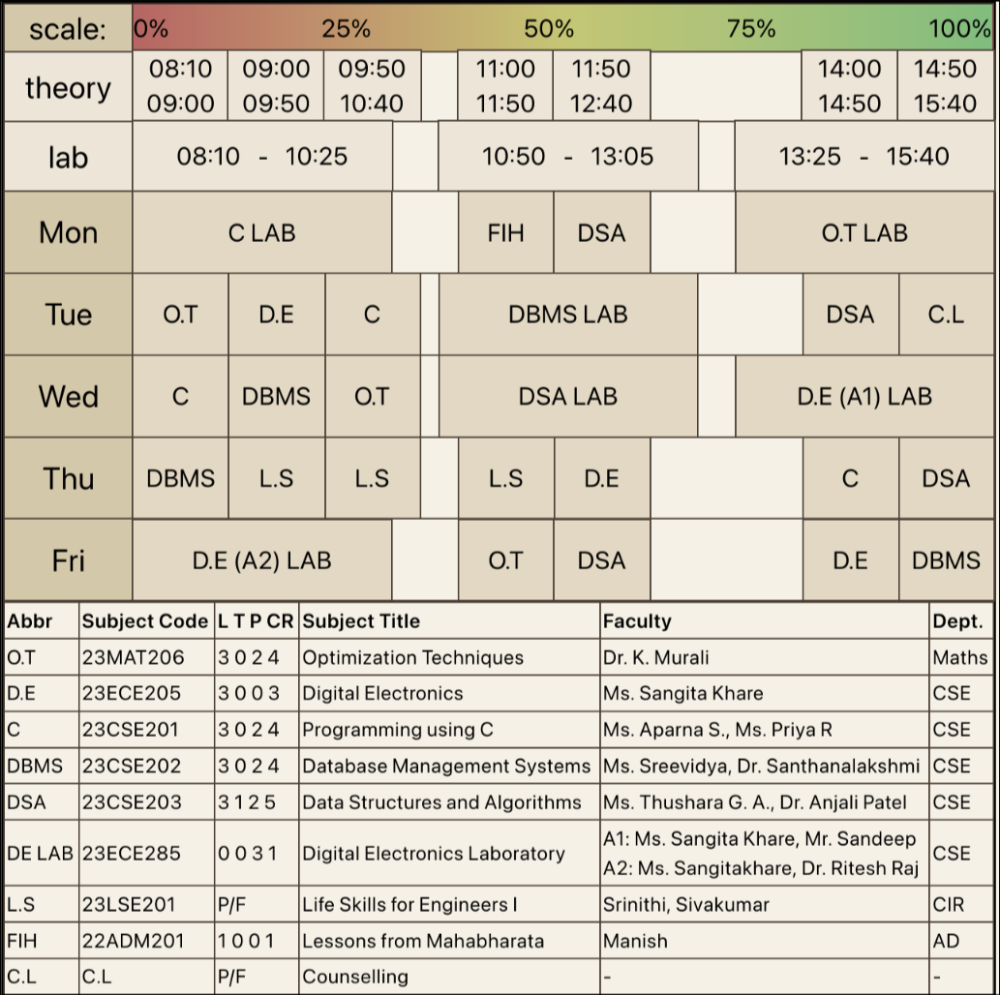
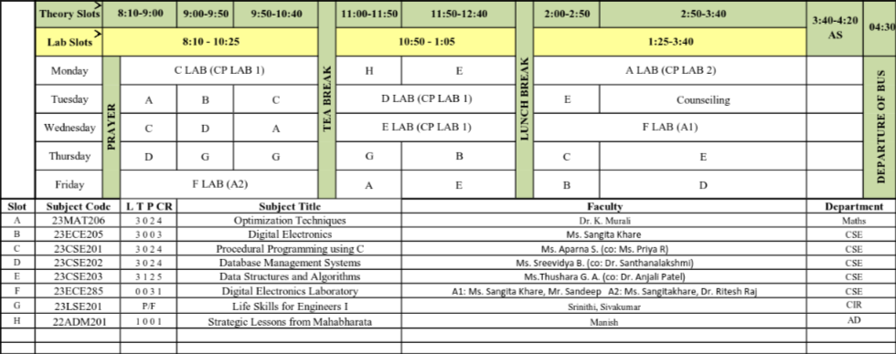

# timetable-icon-generator
The timetables at my uni, Amrita Vishwa Vidyapeetham, are functional, but I thought they could be a lot better. So, I made this project to turn the standard rectangular schedule into a compact, square icon. It's configured with simple JSON files and even scales the class blocks to show how long they actually are (rather than confusingly using a simple table for complex time-slots).

This was mainly made for my own use, especially since the class group pfp is the timetable for quick access, but I thought it might be useful to others too, so I'm sharing it here.

(I've also learnt a lot about Next.js app router and JSON objects, so that's a bonus!)

## My Version:

## Old Version:

## ✨ Features

- **Easy Setup with JSON**: You can set up your courses, times, and schedule with some simple JSON files.
- **Compact Icon View**: It squishes the whole timetable into a square, which is great for a quick look.
- **Accurate Class Durations**: The blocks for each class are sized based on how long they are,\
so you can see the difference between a 10, 20, and a 80 minute break at a glance.

## 🚀 How to Use It

For all the details on how to get this running and set up your own schedule, check out the [CONFIG.md](./CONFIG.md) file.
